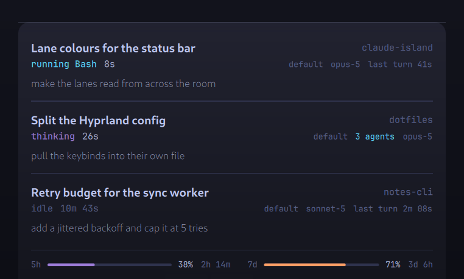
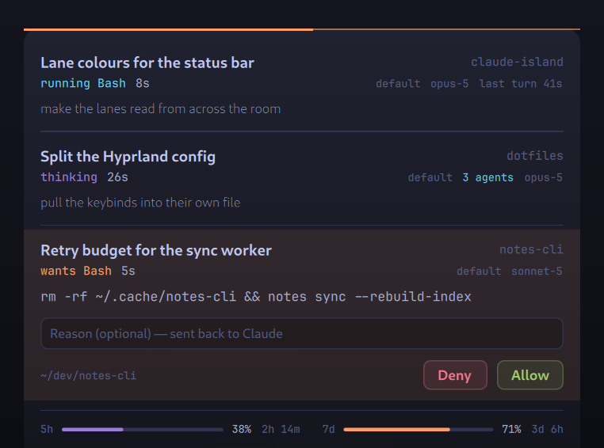

# claude-island

A status bar for Claude Code sessions, for Hyprland and other wlroots
compositors. Every live session gets a lane along the bottom edge of the screen;
hover for detail, and answer permission prompts with a click instead of switching
to the terminal that raised them.


Lane **height** says what is happening — 2px idle, 5px working, 8px blocked on
you — so the bar reads out of the corner of your eye without relying on colour.
Colour says which kind of working: cyan is a tool or text being produced, violet
is the model thinking, orange means it wants you, red means the turn died. Above:
one session running a tool, one thinking, one idle.


When a session is blocked on you the lane stands up, turns orange and pulses.
It is the only warm thing on the bar, so nothing else has to compete with it.



Hover and it grows into a panel: the session title, what it is doing and for how
long, the last thing you asked it, agent count, model, and your 5h/7d usage.



A permission prompt opens the panel on its own and shows the command with
Allow/Deny and an optional reason back to Claude. The orange rule across the top
is a five-second clock: when it runs out the panel folds back to the bar and the
lane keeps pulsing until you deal with it. Hovering takes it off the clock.

**Click a lane** and the terminal running that session comes to the front —
across workspaces, and into the right tab when your terminal will say which one
it is. Hovering a row in the panel lifts it, marks it with its own lane colour,
and prints where that session is working along the foot of the panel. **Right-click** anything, or click *settings* in the open panel, for
theme, colours, position, size and which monitors. The bar is drawn on every
screen, and takes a wider panel on a wider one.

<sup>Shot with `grim` against a blank desktop; the session data is made up, the
surface is not.</sup>

## Requirements

| | |
|---|---|
| a wlroots compositor | Hyprland, sway, river, niri — it is a `wlr-layer-shell` client |
| [quickshell](https://quickshell.org) | the surface; needs Qt 6.7+ for per-corner radius |
| python3 | session discovery and the state feed |
| jq | hook payload parsing |
| bash 5+ | `status.sh` uses `$EPOCHSECONDS` and builtin-only parsing |

Optional, and everything works without them:

| | |
|---|---|
| [claude-pulse](https://github.com/NoobyGains/claude-pulse) | the source of the 5h/7d usage row. Without it that row is simply absent — the island will not poll the usage API itself, because a status bar has no business holding an OAuth token. Point `CA_USAGE_CACHE` at any JSON file of the same shape to use something else. |
| Cantarell, JetBrainsMono Nerd Font | the two faces. Qt substitutes if you do not have them; `CA_FONT_SANS` / `CA_FONT_MONO` to choose your own. |

## Install

```sh
git clone <this repo> ~/dev/claude-island
cd ~/dev/claude-island && ./install.sh
```

It checks dependencies, writes a systemd user service pointing at wherever you
cloned it, and registers the hooks in `~/.claude/settings.json` — backing that
file up first and only ever touching entries that point into this directory.
Re-running it is safe.

```sh
./doctor.sh              # check everything, and say what to do about anything wrong
./uninstall.sh           # service + hooks, keeps your state
./uninstall.sh --purge   # and the state directory
```

`doctor.sh` is the first thing to run if something looks wrong. It checks
dependencies, the compositor, the service and its feed, the heartbeat, which
hooks are registered and where they point, whether the state directory is
writable, and whether `state.py` actually returns usable JSON — then prints what
to do about anything it finds. Exit 0 means nothing is broken; warnings are all
optional things.

## Click-to-approve

Engages for exactly the calls Claude Code was about to ask you about, in any
permission mode. The grant runs on `PermissionRequest`, which fires only when a
decision is needed, and it matches no tool name — so an MCP call, a plan
approval or a notebook edit reaches the panel the same way a `Bash` command
does. A call that mode or your allow rules already settle never gets there:
`auto` mode asks about little, so the island shows little.

What it cannot answer still says so rather than pretending: see
**[Two kinds of waiting](#two-kinds-of-waiting)**.

Nothing is ever approved on your behalf. Any error, timeout, bad payload or
stopped daemon leaves the normal permission flow exactly as it was.

## Configuration

Three ways to the settings window — theme, colours, position, monitors, sizes,
fonts:

- **right-click** anywhere on the bar or the panel
- click **settings** at the bottom of the open panel
- run **`./settings.sh`** — the only route that works when no session is open,
  since the surface hides itself when there is nothing to show. Bind it:

  ```
  # ~/.config/hypr/hyprland.conf
  bind = SUPER SHIFT, I, exec, ~/dev/claude-island/settings.sh
  ```

It writes `~/.config/claude-island/config.json`, which the surface watches, so a
change lands as you make it. There is no apply button and no restart.

The file is also fine to edit by hand. Every key is optional; anything missing
falls back to the default:

```json
{
  "position": "bottom",
  "monitors": "all",
  "theme": "tokyo-night",
  "colors": { "flow": "#5ad6ff" },
  "laneWidth": 46,
  "barHeight": 10,
  "panelWidth": 0,
  "announceMs": 5000,
  "fontSans": "",
  "fontMono": ""
}
```

| key | default | meaning |
|---|---|---|
| `position`   | `bottom` | which screen edge to live on: `bottom` or `top` |
| `monitors`   | `all` | `"all"`, or a list of names: `["DP-1", "eDP-1"]`. A name that is not attached is skipped, so a docked config still works on the train |
| `theme`      | `tokyo-night` | `tokyo-night`, `catppuccin-mocha`, `gruvbox-dark`, `nord`, `everforest-dark` — see `themes.js` |
| `colors`     | `{}` | per-key overrides on top of the theme, six-digit hex |
| `laneWidth`  | 46 | width of one session's lane |
| `barHeight`  | 10 | height of the collapsed bar |
| `panelWidth` | 0 | `0` takes a share of each screen, so a wide monitor gets a wider panel |
| `announceMs` | 5000 | how long a new request holds the panel open |
| `fontSans` / `fontMono` | built-in | override the two faces |

The rest are environment variables on the service or the hooks:

| env | default | meaning |
|---|---|---|
| `CA_IDLE_AFTER` | 90   | seconds of silence before a session reads as idle |
| `CA_TIMEOUT`    | 300  | seconds `approve.sh` waits for a click before deferring |
| `CA_TICK`       | 0.25 | seconds between change checks in the state feed |
| `CA_HEARTBEAT`  | 10   | seconds between full rescans, for process liveness |
| `CA_FONT_SANS`  | Cantarell | face for titles and prose, when the config does not say |
| `CA_FONT_MONO`  | JetBrainsMono Nerd Font | face for status, timers, paths |
| `CA_USAGE_CACHE`| `~/.cache/claude-status/cache.json` | where to read usage limits from |
| `CA_DEBUG`      | unset | `focus.sh` logs what it walked to `focus.log` |

Set them on the service: `systemctl --user edit claude-island.service`, then an
`[Service]` section with `Environment=CA_IDLE_AFTER=120`. Hook-side knobs
(`CA_TIMEOUT`) belong in your shell environment instead, since Claude Code spawns
the hooks.

## Files

| file | role |
|---|---|
| `island.qml`   | the surface — a quickshell layer-shell client, runs as a user service |
| `Settings.qml` | the settings window, opened by right-clicking the surface |
| `themes.js`    | the palettes and the config defaults |
| `state.py`     | session discovery and status; `--serve` streams a JSON line per change |
| `status.sh`    | status hook: one line per state change, on every transition event |
| `approve.sh`   | `PermissionRequest` hook: writes a request, blocks for the answer |
| `session.sh`   | `SessionStart` / `SessionEnd` hook: registers the session |
| `focus.sh`     | brings a session's terminal to the front, and its tab where it can |
| `settings.sh`  | opens the settings window from outside — for a keybind |
| `install.sh`   | dependency check, service, hook registration |
| `doctor.sh`    | diagnoses a broken or partial install |

## How the pieces talk

Files under `$XDG_STATE_HOME/claude-approve/`:

```
sessions/<session_id>    session.sh writes, SessionEnd removes
requests/<tool_use_id>   approve.sh writes, then blocks on the decision
decisions/<tool_use_id>  island.qml writes on click, approve.sh reads
                         verdict on line 1, optional reason on line 2
live/<session_id>.json   status.sh writes on every state change
order.json               when each session started, so the lanes hold still
alive                    state.py --serve touches it; approve.sh checks it
titles.json              parsed-transcript cache, keyed by (version, mtime, size)
approve.log              every request approve.sh saw and what answered it
```

---

# Notes

Why things are the way they are, including several things that turned out not to
work the obvious way.

## Permissions

### Where the grant runs

On `PermissionRequest`, with no matcher. That event fires only when Claude Code
is about to ask, so the request the panel shows you is a prompt that was going to
happen either way, and no matcher means every tool that can prompt arrives —
`mcp__*` calls, `ExitPlanMode`, `NotebookEdit`, whatever a plugin adds next.

It ran on `PreToolUse` for a while, and that was wrong in both directions at
once. `PreToolUse` fires ahead of **every** tool call, so the island asked about
greps, reads and allowlisted commands nobody wanted gated; and the registration
carried a `Bash|Write|Edit|WebFetch` matcher, so every other prompt went to the
terminal with the panel saying it could not help.

The move to `PreToolUse` was made on a misreading of this event, recorded here
for a while as a Claude Code bug. It was not one. The decision was returned as

```json
{"hookSpecificOutput":{"hookEventName":"PermissionRequest","decision":"allow"}}
```

where `decision` is an **object**, not a string:

```json
{"hookSpecificOutput":{"hookEventName":"PermissionRequest","decision":{"behavior":"allow"}}}
```

A string there is silently ignored and the prompt goes to the terminal, which
looks exactly like an event whose decision is not honoured. Both directions are
verified end to end on 2.1.270: an allow runs the tool, a deny blocks it and
`decision.message` reaches Claude verbatim.

Two things follow from the shape of the event. It carries no `tool_use_id`, so
`approve.sh` mints its own id — it only has to be unique and agreed with the
surface. And `deny` has a `message` field where `allow` has none, so a note typed
on an allow goes to `approve.log` and no further.

If the daemon is not running, blocking here would stall the prompt for the full
timeout before deferring to it anyway. `state.py --serve` touches `alive` on
every scan and `approve.sh` defers in 26ms if that heartbeat is stale.

### Reasons

A pending row carries an optional one-line note that rides back to Claude as
`permissionDecisionReason`. On a deny it is the useful half — "not on prod, use
the stage profile" tells the model what to do instead, where a bare refusal just
makes it guess.

Three things about it are deliberate:

- **The decision file is written through `FileView`, not `sh -c`.** The reason is
  free text a person typed; building a shell command string out of it would make
  every decision an injection site.
- **Enter does nothing.** With two buttons there is no unambiguous target for it,
  and guessing one is how a keystroke becomes an approval. Escape leaves the box.
- **Keyboard focus is `OnDemand`, and only while something is asking.** Holding
  focus permanently is how a stray keypress once produced a spurious allow here.
  The surface takes focus when you click into the box and at no other time, and
  gives it back when the request clears.

Newlines in the reason are collapsed, and `approve.sh` ignores a decision file
whose first line is not exactly `allow` or `deny` — a half-written file presents
as `allo`, and a partial read must mean keep waiting, never guess.

### Two kinds of waiting

`waiting` can mean two different things and they are not interchangeable:

- **A request the island owns.** `approve.sh` blocked, wrote `requests/<id>.json`,
  and the panel shows Allow/Deny. Clicking writes `decisions/<id>` and the hook
  returns it.
- **A prompt in the terminal.** `Notification` / `permission_prompt` only *tells*
  us Claude Code is asking. Since the grant moved to `PermissionRequest` this is
  the narrow case it should be: a prompt that event does not cover, such as the
  network request of a sandboxed command, or a session whose hooks predate the
  move. There is nothing to answer with, so the row says "waiting in terminal"
  and points you there rather than showing a button-less alert.

Nothing clears the second kind: if you answer in the terminal, no event fires to
say so, and the session sat on a dead `waiting` indefinitely. The transcript is
the proof it was resolved — it only moves once the tool has actually run or been
refused — so a feed `waiting` with no request behind it is dropped as soon as the
transcript passes the moment the waiting began.

`approve.log` records every request and what answered it, with timings. A
decision that goes the wrong way is otherwise invisible after the fact: the
transcript records only that the user declined, never who declined or why.

`approve.sh` never approves on its own: any error, timeout, missing daemon or
bad payload exits 0 with no output, which defers to Claude Code's normal
terminal prompt.

## Session discovery

Transcript mtime is not liveness — a closed session keeps a recent mtime. Every
session shown is backed by a running process:

1. the `SessionStart` registry (exact id, `/proc/<pid>` verified)
2. `claude --resume <transcript>` on the command line (exact id)
3. a bare `claude`, matched to the newest unclaimed transcript under its
   *project* directory (`/home/x` -> `-home-x`), which encodes the launch cwd
   and so survives the session `cd`-ing elsewhere

Excluded: the daemon, `bg-pty-host`, `bg-spare` and anything under them
(background sessions are real processes but not open terminals), and any
session whose transcript has a `continued-in` pointing at a live successor.

## Focus

Clicking a lane runs `focus.sh <claude-pid>`, and the pid is the only thing the
surface knows. It is not enough on its own: **a claude process does not own a
window.** The terminal above it does, and that terminal may be holding four
sessions in four tabs. So the walk happens in two stages.

Stage one is the process tree. `focus.sh` climbs `/proc/<pid>/stat` collecting
ancestors — typically `claude -> fish -> kitty` — and asks the compositor which
of them owns a window (`hyprctl clients`, `swaymsg`, `niri msg`). That is the
window to raise, and raising it crosses workspaces.

Stage two is the tab, and it cannot be done from the outside: no compositor knows
a terminal has tabs. The mapping exists in exactly one place, which is the
session's own environment — so `focus.sh` reads `/proc/<pid>/environ` and uses
whatever is in there:

| variable | what it does |
|---|---|
| `TMUX` + `TMUX_PANE` | `tmux select-window` / `select-pane` on that socket — exact |
| `KITTY_LISTEN_ON` + `KITTY_WINDOW_ID` | `kitty @ focus-window --match id:` — exact, but needs `allow_remote_control yes` and a `listen_on` socket in `kitty.conf` |
| `WEZTERM_PANE` | `wezterm cli activate-pane` — exact |

kitty is the one that needs setting up, because its socket is off by default.
Add to `kitty.conf` and restart it:

```
allow_remote_control socket-only
listen_on unix:@mykitty-{kitty_pid}
```

`socket-only` is the point of that pair: programs running *inside* kitty cannot
drive it through escape codes, only something holding the socket path can.
`doctor.sh` says which of the two you have.

Without one of those you get the window and not the tab, which is still most of
the way there. Nothing in stage two can fail loudly: a missing tool or a terminal
with no control channel costs precision, never the window.

One Hyprland note, since it cost an hour: **0.56 moved dispatchers to a Lua API**
and the old spelling now errors out. `focus.sh` tries
`hyprctl dispatch focuswindow address:0x…` first and falls back to
`hyprctl dispatch "hl.dsp.focus({window='address:0x…'})"`, so it works either
side of that change. Worth knowing that `hyprctl eval "hl.dsp.focus(…)"` only
*builds* a dispatcher and returns `ok` without doing anything — it has to go
through `hyprctl dispatch`, which wraps it in `hl.dispatch()`.

## Status

Status comes from hook events, not from the transcript. **The transcript cannot
report it.** It is a post-hoc log: a text block is only appended once it is
finished, and it carries `stop_reason: end_turn` when the turn ends — so
"answering right now" exists in the file for about a millisecond before it reads
as idle. Thinking blocks land 4ms before the `tool_use` they precede. Tail it and
you get two states and no others: `thinking` (a `tool_result` is the last line)
and `idle` (nothing new). That was the original bug.

`status.sh` is wired to every transition event instead:

| status | event |
|---|---|
| `waiting`         | a pending `approve.sh` request, or `Notification` / `permission_prompt` |
| `thinking`        | `UserPromptSubmit`, `PostToolUse`, `PostToolUseFailure`, `PostCompact` |
| `running <Tool>`  | `PreToolUse` (`tool_name`) |
| `responding`      | `MessageDisplay` — fires while assistant text streams |
| `compacting`      | `PreCompact` |
| `error`           | `StopFailure` — the turn died on an API error |
| `limit`           | `Notification` / `quota_auto_resume_*` — parked on the usage limit |
| `idle`            | `Stop`, `Notification` / `idle_prompt`, `SessionStart` |

`error` matters because a turn that died looks identical to a finished turn from
the transcript — it used to read as `idle`, which is exactly the wrong thing to
say about a session that stopped without doing the work.

The feed also carries two things that are not statuses: `agents`, a live count
from `SubagentStart` / `SubagentStop`, and `model`, from `SessionStart` and
`PostModelSwitch`. Subagents are the one case that legitimately reports from
inside an agent context, so they are counted before the guard that drops every
other subagent-raised event.

The transcript rules stay as the fallback for sessions that started before the
hooks were installed; `src` in the JSON says which one answered (`live`,
`transcript`, or `hook` for a pending request). A live file is only trusted
while its `ts` is at least as current as the transcript's last event, so a
session whose hooks are not loaded cannot be pinned to a stale state by a file
left over from a previous run.

### How status.sh parses a payload

`status.sh` never parses a field with a bracket expression. A `}` inside `${...}`
closes the expansion early, so `${v%%[,}]*}` silently parses as something else
and quietly corrupted every file it touched; fields are trimmed one delimiter at
a time instead.

### What the feed costs

`state.py --serve` runs once and stays. Each tick is a handful of `stat()` calls
over the state directories and the transcripts of the sessions on screen; the
scan only runs when one of them moved, and a line is only printed when something
*drawn* changed. A full rescan still runs every `CA_HEARTBEAT` (10s) regardless,
because process death has no hook behind it — a killed terminal never sends
`SessionEnd`.

Measured on this machine:

| | CPU (one core) | |
|---|---|---|
| spawning `state.py` per frame at 5Hz | 25.0% | the old poll |
| spawning it at 1Hz | 5.1% | the old idle poll |
| `--serve` | **0.25%** | feed process alone |
| whole service, session working | **1.0%** | was 25% |

A one-shot run costs 48ms of CPU, 16ms of which is bare interpreter startup
(`python3 -c pass` measured at 15.9ms) — so at 5Hz a quarter of a core went on
redrawing a 10px bar. Latency did not suffer: a request file lands on screen in
~167ms, against up to 200ms for the poll it replaced.

Memory is the trade: the feed is a resident 14.6MB RSS / 8.2MB PSS instead of a
process spawned and destroyed per frame. The surface itself is 176MB RSS /
103MB PSS, nearly all of it Qt and GPU driver mappings; the cgroup reports 87MB.

### What the hooks cost

`status.sh` runs on `MessageDisplay`, which fires repeatedly while text streams,
so it uses bash builtins only, forks nothing until it exits, and reads just the
first 1KB of stdin — every field it needs is near the front. A `PostToolUse`
`tool_result` can be megabytes, and reading all of it in bash costs ~4s versus
2.7ms for the head. It drains the remainder through `cat` so the writer never
sees EPIPE, and throttles `MessageDisplay` to one write every 2s.

Events raised inside a subagent carry the parent's `session_id`; they are
ignored, since the parent's own `running Agent` already covers that span.

## Design

The bar is read peripherally, in about the time it takes to glance at the bottom
of the screen, so the two questions it answers there are *is anything working*
and *does anything want me*.

**One surface per monitor, sized to it.** A single layer-shell window lands on
whichever screen the toolkit picked and nowhere else, so the bar was simply
missing from half a two-monitor desk. Each screen now gets its own surface with
its own hover state — reaching for one panel must not open the other — and the
panel takes a share of the screen it is on rather than a constant tuned on one
laptop, clamped so it is neither cramped nor a billboard.

**Flipping to the top edge is positioned, not anchored.** Everything that touches
an edge is placed with a `y` binding rather than a conditional anchor, and that is
not a style preference: in QML an anchor that has been established **cannot be
released by re-binding it to `undefined`**. Since the config loads a frame after
the surface is built, the bar was anchored to the bottom first and then to the
top as well — anchored to both, and stretched down the whole screen as a black
slab. It looks like a rendering bug and it is an anchoring one.

**Lane order never changes.** Lanes are ordered by when the session started —
oldest leftmost, new ones appended on the right — and nothing moves once it is
placed. Ordering by recent activity meant a lane jumped position every time its
session did anything, which is the opposite of what a row of lanes is for: you
learn where a session lives and then read it by position. A pending request
deliberately does not jump the queue either; it already has the heartbeat, the
glow and a panel that opens itself, and moving the lane as well means reaching
for a target that just shifted. Start times live in `order.json`, seeded from the
first timestamp in each transcript, so the order survives a restart.

**Height answers them; colour only says which kind.** A lane is 2px idle, 5px
working, 8px blocked on you — three steps, because inside a 10px bar a 4px lane
and a 5px lane are the same lane. The silhouette carries the reading, so it
survives being seen out of the corner of an eye, and it does not depend on colour
at all.

**Hue is rationed.** Warm (`#ff9e64`) appears in exactly one situation — a
session is blocked on you — so it never competes for attention. The other two
working states are pushed apart on the wheel rather than kept as neighbours:
cyan (`#5ad6ff`) is the machine acting on the world, violet (`#9d7cd8`) is the
machine thinking, slate is idle. The first pass used cyan against blue
(`#7dcfff` / `#7aa2f7`) and that was a distinction only a colour picker could
see in a 5px lane — the categories were in the code but not on the screen. Green
and red exist only on Allow/Deny, where a two-way choice earns them. The
version before that spent six saturated hues on six statuses, which left nothing
louder than anything else.

**Everything is lit, not painted.** Lanes and the panel carry a gradient from
their own top edge, and a working lane casts a blurred glow in its own colour —
which is what makes a session catch your eye without the lane having to get
taller. The first attempt drew the glow as a gradient rectangle and it looked
like a smear, because a glow has to fall off sideways as well as upward; it is a
`MultiEffect` coloured shadow now.

**Two typefaces, one job each.** Cantarell for human intent — session titles, the
prompt you typed. JetBrains Mono for machine state — status, timers, paths,
percentages. The split is the hierarchy, so neither has to shout.

**Shimmer.** A band of light sweeps along any lane that is actually producing
something — 1.4s to cross, then 3s of rest. Continuous motion would read as a
progress bar; the rest is what makes it a pulse of light. Only working lanes get
it: a stalled, errored or waiting lane that still looked alive would be a lie,
and the waiting lane has the heartbeat to itself.

The rest is also the cost control. The surface only repaints while the sweep is
moving, so the duty cycle is the CPU bill: a working session costs 2.6% of a core
at 1.2s of rest and 1.8% at 3s, against 0.2% with nothing animating. Moving the
sweep outside the glow's layered item (so the blur shader is not re-run every
frame) was worth only 0.3 points — the cost is compositing the animation, not the
blur.

**One moment of unprompted motion: the heartbeat.** Only the lane that wants you
pulses, and it is two quick beats and a rest rather than a sine fade — a fade
reads as "loading", a pulse reads as something asking for you, which is what it
is. The beat is carried by the **glow**, not the lane: dimming orange toward a
near-black ground turns it brown however shallow the dip is, so the colour was
simply the wrong channel for it. The lane holds its true colour and the light
around it swells, which reads as a beacon. Everything else moves only in answer
to something you did.

**The panel announces itself, then gets out of the way.** A new request opens the
panel on its own, and a countdown drains along its top edge; after
`CA_ANNOUNCE_MS` (5s) it collapses back to the bar and the pulsing lane carries
the request until you deal with it. Holding it open until answered — which is
what it did first — meant a surface that cannot take your keyboard sat over the
screen indefinitely. Reaching for the panel takes it off the clock: hovering
cancels the countdown, and from then on it is yours until you leave.

The mask is the other half of that. It jumps straight to the final size and reads
the panel's *target* height rather than its animating one — a mask that tracks
the animation is a mask smaller than what you can see for a fifth of a second,
and reaching for Allow at the right edge during that window put the click on the
window underneath, which fired `onExited` and collapsed the panel out from under
you.

**Motion that answers you.** Hovering rises the panel out of the bar with a
slight overshoot, and the rows come up in sequence (45ms apart) so the eye gets
an order to read them in. The bar does not fade out — the panel is opaque and
anchored to the same edge, so it simply covers it; fading both made two surfaces
out of what should read as one. Clicking Allow or Deny fills that button solid,
flips its label to read against it, steps the other button back to 25%, and
washes the row in the answer's colour. The feed clears the request about 250ms
later, which is exactly enough for the confirmation to land — before, the row
just vanished and you never saw the decision take.

Lanes share the bar's full width, so a single session fills the whole pill rather
than sitting as one stub in an empty frame. Past the minimum width the bar grows
by a lane per session instead of subdividing what it has, so opening a session
never squeezes the others below `laneW`.

The usage fills animate through a fraction, never through their width. A
collapsed panel is laid out at zero width, and animating the width directly let
any layout excursion replay the fill sweeping up from empty; bound through
`frac`, the width tracks the layout instantly and only a real change in the
number animates.

In the panel, only the blocked session gets a ground, and it is warm rather than
a neutral lift — giving every row a card makes them all equally loud.

## Usage limits

Read from claude-pulse's cache (`CA_USAGE_CACHE`, default
`~/.cache/claude-status/cache.json`) rather than polling
`api.anthropic.com/api/oauth/usage` directly — no second poller, no duplicate API
calls, and no OAuth token living in a status bar. That cache only refreshes while
a session renders its status line, so the panel prints the age once it is stale.

Nobody has to have claude-pulse installed. A missing cache is a normal state, not
an error: `usage()` returns `None`, the limits row is omitted, and every other
part of the surface is unaffected.

## Odds and ends

- `state.py` with no arguments prints a single JSON blob — the quickest way to
  see exactly what the surface is being told.
- Bump `SCAN_VERSION` in `state.py` whenever `scan_transcript`'s output shape
  changes, or cached entries from an older build come back missing the new keys.
- Hooks are read when a session starts. An already-open session keeps the old
  set until restarted or reloaded with `/hooks`; until then it falls back to the
  transcript rules, which still work, just with fewer states.
